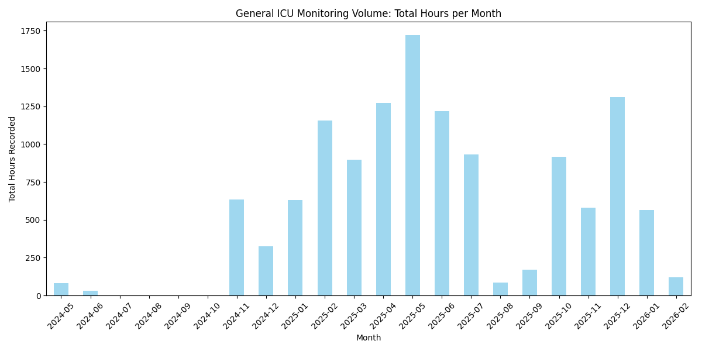
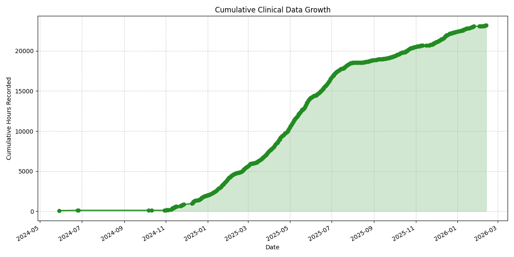

# Final Clinical Data Audit Report

## Executive Summary

- **Total Monitoring Hours**: 23203.60 hours
- **Total Vital Files Processed**: 5807
- **Boxes Monitored**: 13
- **Average Duration per Session**: 254.5 minutes

## 1. Monitoring Adoption and Volume

This section summarizes the digital activity across the ICU boxes.

| box   |   total_hours |   file_count |   avg_complexity |
|:------|--------------:|-------------:|-----------------:|
| box10 |      2156.14  |          510 |          2.12549 |
| box11 |       263.886 |           64 |          2.29688 |
| box12 |      2546.44  |          401 |          2.5187  |
| box13 |      1420.36  |          549 |          2.08561 |
| box14 |      5896.27  |         1235 |          2.417   |
| box2  |       546.341 |          183 |          1.80874 |
| box3  |      1149.4   |          223 |          2.58744 |
| box4  |      2055.5   |          545 |          2.84404 |
| box5  |      1589.13  |          371 |          2.2965  |
| box6  |      2350.13  |          415 |          2.85783 |
| box7  |      1127.45  |          335 |          3.06269 |
| box8  |       913.946 |          346 |          2.4104  |
| box9  |      1188.62  |          294 |          2.92177 |

### General Monitoring Volume per Month

### Cumulative Clinical Data Growth

## 2. Signal Complexity and Maturity

Distribution of monitored signal types across the facility.

## 3. Physiological Stability Insights

Summary of patient dynamics (Mean Volatility and Time-in-Range).

| box   |   HR_volatility |   HR_in_range_pct |   MAP_volatility |   MAP_in_range_pct |   SpO2_volatility |   SpO2_in_range_pct |
|:------|----------------:|------------------:|-----------------:|-------------------:|------------------:|--------------------:|
| box10 |         4.14243 |           59.7842 |          9.66343 |            94.6829 |           1.6246  |             95.7741 |
| box11 |         6.6136  |           79.2373 |         11.2877  |            82.7042 |           1.97743 |             93.5672 |
| box12 |         5.68488 |           62.3525 |          9.41727 |            88.3429 |           1.70102 |             95.6338 |
| box13 |         5.9726  |           65.8139 |          8.92625 |            89.4504 |           3.04085 |             65.0825 |
| box14 |         3.90996 |           88.2308 |          9.61554 |            91.2236 |           1.63811 |             94.0881 |
| box2  |         4.28681 |           72.6206 |          9.33886 |            94.7216 |           1.45105 |             95.4771 |
| box3  |         5.20758 |           75.0722 |         10.029   |            86.4914 |           1.48671 |             95.8788 |
| box4  |         5.5879  |           48.0032 |          9.38812 |            97.0805 |           1.79105 |             94.0241 |
| box5  |         3.95875 |           72.5442 |         10.7954  |            88.0901 |           2.58136 |             87.2057 |
| box6  |         5.53077 |           68.881  |          9.82335 |            88.112  |           2.15203 |             92.2161 |
| box7  |         5.80975 |           92.6591 |         13.7204  |            98.6148 |           1.69302 |             91.5355 |
| box8  |         4.71102 |           63.6016 |          8.09306 |            94.3253 |           2.41078 |             87.4681 |
| box9  |         4.20033 |           90.0842 |          7.94574 |            89.1437 |           2.12654 |             79.0377 |

---
*Generated automatically by Wave Studies Audit Suite*